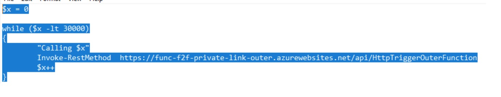

### Sample code for calling one from another Azure Function using dependency injection
https://learn.microsoft.com/en-us/azure/azure-functions/functions-dotnet-dependency-injection#use-injected-dependencies

### Steps to use it with Private Endpoints
# VNet and Subnets
    1) Create VNet with 2 subnets + Bastion:
        1) PrivateEndPoint
        2) FunctionsVNetIntegration
# Create Storage Account
    1) Create Storage Account Standard, and retrieve Connection String
    2) Add Private Endpoint to PrivateEndPoint subnet
    3) Restrict Access to the FunctionsVNetIntegration subnet
# Create Inner Function
    1) Create Function Inner: Code, ASPNET 6, Unix, Dedicated Plan, New Storate Account, App Insights
    2) Add the STG_CONNSTRING config variable with the Connection String of Storage Account
    3) Deploy the Code to the Function 
    4) Add Private Endpoint to PrivateEndPoint subnet
    5) Add VNet integration to FunctionsVNetIntegration vnet
    6) Test and get the API URL
# Create the Outer Function
    1) Create Function Inner: Code, ASPNET 6, Unix, Dedicated Plan, New Storate Account, App Insights
    2) Add the INNER_API_URL config variable with the Inner Function URL
    3) Deploy the Code and Test it - with Test function (not external calls)
    4) Add Private Endpoint to PrivateEndPoint subnet
    5) Add VNet integration to FunctionsVNetIntegration vnet
# Create a VM and validate the solution using the Bastion
    1) Create a Windows VM
    2) Connect to the VM using Bastion
    3) Run the following code on Powershell to validate the solution
    
    
    
    